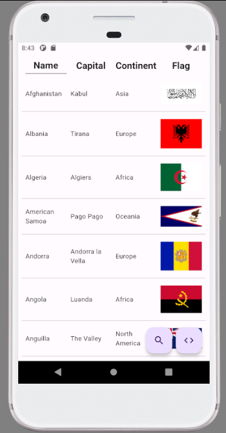
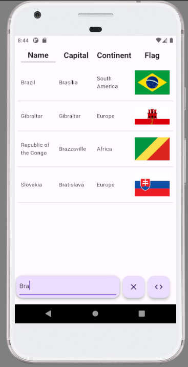
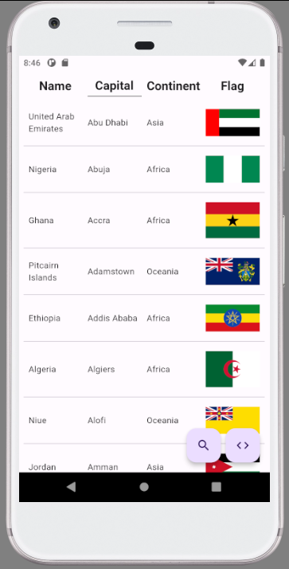

# Countries Flutter App

    
    

This Flutter application, named "Countries," is developed using Flutter version 3.10.1. The app consumes a REST API to retrieve country information, such as capital, continent, and flag. The REST API used in this project can be found at: [restcountries.com](https://restcountries.com/)

> **Note:** This repository serves as an example for implementing a REST API in a Flutter application.

## Article on Medium

Read my Medium article to learn more about the implementation details and insights behind this project: [Link to the Article](https://medium.com/p/2460d90320aa/)

## Repository Comparison

If you're interested in a more advanced implementation of the same API, check out this repository: [Flutter-Country-Info-using-API](https://github.com/sumeetbhut/Flutter-Country-Info-using-API)

## Project Structure

The project structure consists of the following directories:

- **data/model**: Contains the country model class, which was generated using [quicktype.io](https://app.quicktype.io/)
- **data/provider**: Handles API communication
- **data/service**: Acts as a middle layer between the UI and the API, allowing for easy swapping of APIs without affecting the code
- **screens**: Contains the home page, which focuses on showcasing the API connection

## Features

The Countries app provides the following features:

- Displaying a list of countries in alphabetical order
- Showing the country's capital and continent, along with its flag
- Sorting countries alphabetically by name, capital, or continent by clicking on the respective buttons in the top menu
- Search functionality that allows users to find countries based on their names, capitals, or continents
- Buttons at the bottom, one of which directs users to this GitHub repository and the other activates a search input field
- Cross-platform compatibility: The app runs on iOS, Android, and the web. You can access the web version hosted on GitHub Pages via this link: [GitHub Pages Link](https://raphaelrat.github.io/flutter-restapi-country)

> **Note:** Ensure that you have Flutter SDK installed and set up on your machine to run the app successfully.

## How to Use

1. Clone this repository: `git clone https://github.com/RaphaelRat/flutter-restapi-country.git`
2. Change to the project directory: `cd flutter-restapi-country`
3. Run the app: `flutter run`

Feel free to explore, modify, and contribute to this project. If you have any questions or suggestions, please open an issue or contact me.

## Screenshots

 There are no screenshots of the web application as you can access it yourself through this  [link](https://raphaelrat.github.io/flutter-restapi-country).
 

  
  
  

 
 

